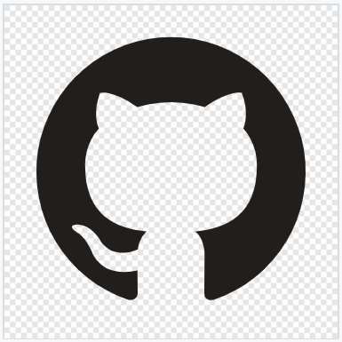
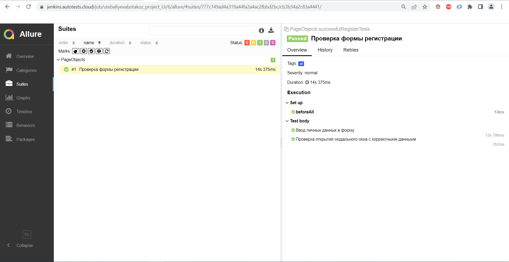
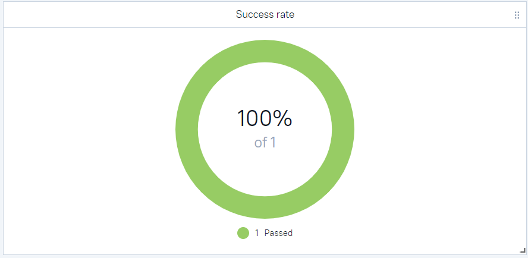
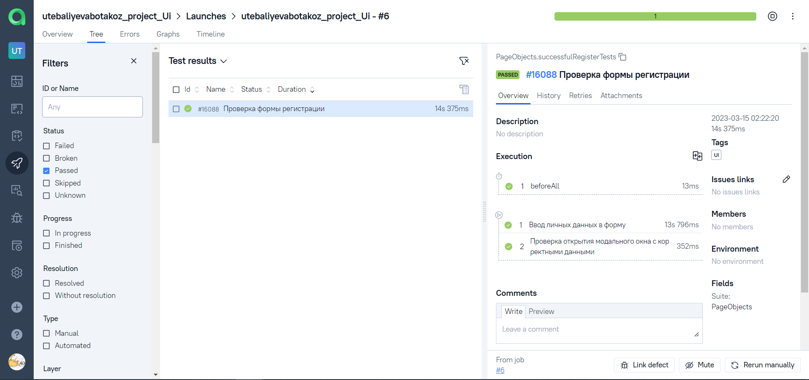

<h2 align="center"> Проект по автоматизации тестирования мобильной версии сайта wikipedia.org </h2>
<p  align="center">


</p>


# <a name="Содержание">Содержание</a>
+ [Описание](#Описание)
+ [Технологии и инструменты](#Технологии-и-инструменты)
+ [Варианты запуска](#Варианты-запуска)
    + [Команды для gradle](#команды-для-gradle)
    + [Запуск в Jenkins](#запуск-в-jenkins)
+ [Telegram уведомления](#Telegram-уведомления)
+ [Результаты тестов в Allure Report](#Результаты-тестов-в-Allure-Report)
+ [Интеграция с Allure TestOps](#Интеграция-с-Allure-TestOps)
+ [Видео запуска тестов](#Видео-запуска-тестов)


# <a name="Описание">Описание</a>
Проект состоит из тестов API для сайта https://reqres.in/.
Краткий список фактов о проекте:
- [x] Используются Модели и Спецификации (Specs)
- [x] Allure rest-assured listener с custom templates
- [x] Интеграция с `Allure TestOps`
- [x] Автотесты как тестовая документация
- [x] Уведомления в Telegram

# <a name="Технологии и инструменты">Технологии и инструменты</a>
<p  align="center">
  <code></code>
  <code></code>
  <code></code>
  <code></code>
  <code></code>
  <code></code>
  <code></code>
  <code></code>
  <code></code>
  <code></code>
  <code></code>
  <code></code>
</p>

`Java` - язык программирования автотестов \
`Selenide` - фреймворк, на котором написаны автотесты \
`Gradle` - инструмент автоматической сборки  \
`JUnit5` - фреймворк тестирования \
`Jenkins` - CI/CD для запуска тестов \
`Selenoid` - для удаленного запуска браузера в `Docker` контейнерах \
`REST Assured` - для тестирования REST-API сервисов\
`Allure Report` - для построения графических отчетов \
`Telegram Bot` - для уведомлений о результатах тестирования в телеграм бот\
`Allure TestOps` - как система управления тестированием

[Вернуться к оглавлению ⬆](#Содержание)

# <a name="Варианты запуска">Варианты запуска</a>

## <a name="GradleCommand">Команды для Gradle</a>

Для запуска локально и в Jenkins используется следующая команда:
```bash
gradle clean test
```


## <a name="Запуск в Jenkins">Запуск в [Jenkins](https://jenkins.autotests.cloud/job/utebaliyevabotakoz_project_mobile/)</a>


Главная страница проекта:
<p  align="center">

</p>


Результат сборки проекта доступен в:
>- <code><strong>*Allure Report*</strong></code>
>- <code><strong>*Telegram bot*</strong></code>
>- <code><strong>*Allure TestOps*</strong></code>


[Вернуться к оглавлению ⬆](#Содержание)


## <a name="Telegram">[Уведомление в Telegram о результатах прогона тестов](https://t.me/Qa_botakoz_bot)</a>

Telegram-бот Autotests bot отправляет графический отчет каждой сборки.
<p  align="center"> </p>


# <a name="AllureReport">Результаты тестов в [Allure Report](https://jenkins.autotests.cloud/job/utebaliyevabotakoz_project_mobile/allure/allure)</a>

## Главное окно


<p align="center">
  
</p>

##  Тесты

<p align="center">
  
</p>

<p align="center">
  
</p>


##  Графики

<p align="center">
  
</p>

<p align="center">
  
</p>

<p align="center">
  
</p>


[Вернуться к оглавлению ⬆](#Содержание)

# <a>Интеграция с [Allure TestOps](https://allure.autotests.cloud/launch/20439/tree?treeId=0)</a>


## Allure TestOps Dashboard

<p align="center">
  
</p>

## Allure TestOps Test Cases

<p align="center">
  
</p>


[Вернуться к оглавлению ⬆](#Содержание)
